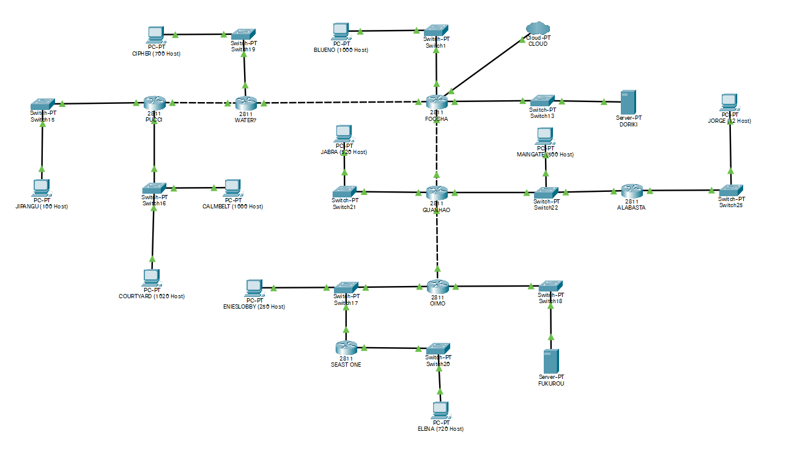
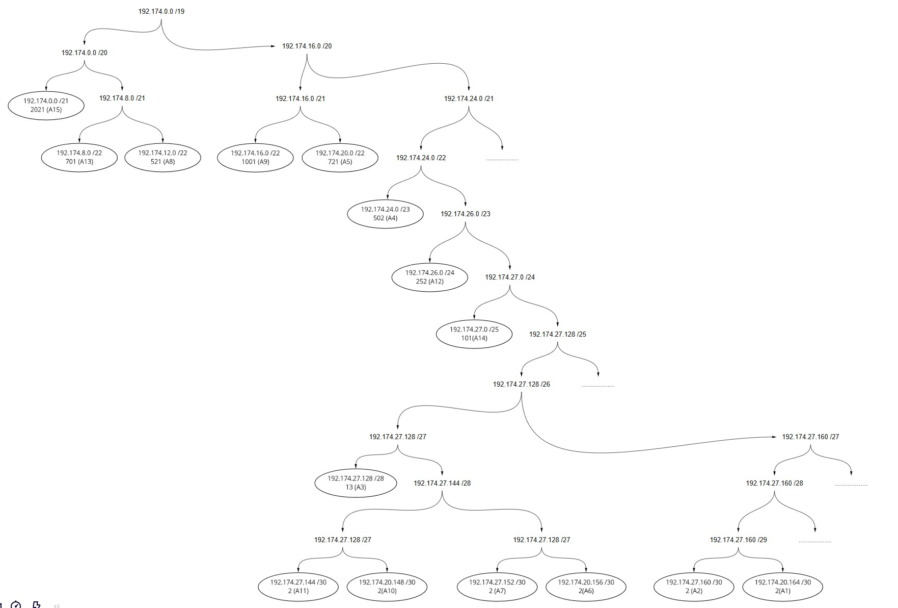

# Jarkom-Modul-4-A11-2021
VLSM + CIDR

#
1. Frederick William Edlim 05111940000016
2. Thomas Dwi Awaka 05111940000021
3. Allam Taju Sarof 05111940000053
#

# VLSM di CPT
## Pembagian Subnet

Kelompok kami mengerjakan teknik **VLSM pada CPT**, sedangkan teknik **CIDR pada UML**.
| Subnet | 								IP 				| Subnet mask 		| netmask	| Jumlah |
|A1 (Fukurou) |							192.174.27.164	| 255.255.255.252	| /30		| 2 |
|A2 (Doriki) |							192.174.27.160	| 255.255.255.252	| /30		| 2 |
|A3 (Jorge) |							192.174.27.128	| 255.255.255.240	| /28		| 13 |
|A4 (Guanhao + Maingate + Alabasta) |	192.174.24.0	| 255.255.254.0		| /23		| 502 |
|A5 (Elena) |							192.174.20.0	| 255.255.252.0		| /22		| 721 |
|A6 (Guanhao + Oimo) |					192.174.27.156	| 255.255.255.252	| /30		| 2 |
|A7 (Foosha + Guanhao) |				192.174.27.152	| 255.255.255.252	| /30		| 2 |
|A8 (Jabra) |							192.174.12.0	| 255.255.252.0		| /22		| 521 |
|A9 (Blueno) |							192.174.16.0	| 255.255.252.0		| /22		| 1001 |
|A10 (Water7 + Foosha) |				192.174.27.148	| 255.255.255.252	| /30		| 2 |
|A11 (Pucci + Water7) |					192.174.27.144	| 255.255.255.252	| /30		| 2 |
|A12 (Enieslobby) |						192.174.26.0	| 255.255.255.0		| /24		| 252 |
|A13 (Cipher) |							192.174.8.0		| 255.255.252.0		| /22		| 701 |
|A14 (Jipangu) |						192.174.27.0	| 255.255.255.128	| /25		| 101 |
|A15 (Calmbelt + Courtyard) |			192.174.0.0		| 255.255.248.0		| /21		| 2021 |
|Total |												| 255.255.224.0		| /19		| 5845 |

Subnet besar yang dibentuk memiliki NID 192.168.0.0 dengan netmask /19. Pembagian IP berdasarkan NID dan netmask dihitung menggunakan pohon pada gambar di bawah:

Untuk routing pada CPT, diberikan static route pada semua router yang ada dengan route sebagai berikut untuk setiap router:

// frederick.txt

// tom.txt