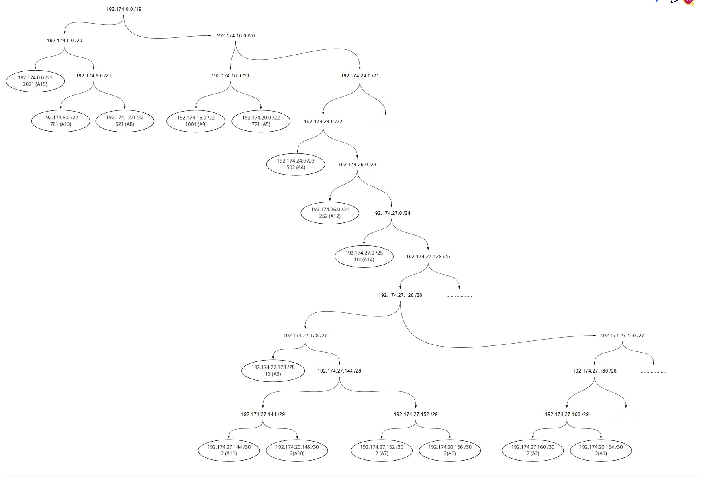

# Jarkom-Modul-4-A11-2021

VLSM + CIDR

#

1. Frederick William Edlim 05111940000016
2. Thomas Dwi Awaka 05111940000021
3. Allam Taju Sarof 05111940000053

#

# VLSM di CPT

## Pembagian Subnet


Kelompok kami mengerjakan teknik **VLSM pada CPT**, sedangkan teknik **CIDR pada UML**.
| Subnet | IP | Subnet mask | netmask | Jumlah |
|A1 (Fukurou) | 192.174.27.164 | 255.255.255.252 | /30 | 2 |
|A2 (Doriki) | 192.174.27.160 | 255.255.255.252 | /30 | 2 |
|A3 (Jorge) | 192.174.27.128 | 255.255.255.240 | /28 | 13 |
|A4 (Guanhao + Maingate + Alabasta) | 192.174.24.0 | 255.255.254.0 | /23 | 502 |
|A5 (Elena) | 192.174.20.0 | 255.255.252.0 | /22 | 721 |
|A6 (Guanhao + Oimo) | 192.174.27.156 | 255.255.255.252 | /30 | 2 |
|A7 (Foosha + Guanhao) | 192.174.27.152 | 255.255.255.252 | /30 | 2 |
|A8 (Jabra) | 192.174.12.0 | 255.255.252.0 | /22 | 521 |
|A9 (Blueno) | 192.174.16.0 | 255.255.252.0 | /22 | 1001 |
|A10 (Water7 + Foosha) | 192.174.27.148 | 255.255.255.252 | /30 | 2 |
|A11 (Pucci + Water7) | 192.174.27.144 | 255.255.255.252 | /30 | 2 |
|A12 (Enieslobby) | 192.174.26.0 | 255.255.255.0 | /24 | 252 |
|A13 (Cipher) | 192.174.8.0 | 255.255.252.0 | /22 | 701 |
|A14 (Jipangu) | 192.174.27.0 | 255.255.255.128 | /25 | 101 |
|A15 (Calmbelt + Courtyard) | 192.174.0.0 | 255.255.248.0 | /21 | 2021 |
|Total | | 255.255.224.0 | /19 | 5845 |

Subnet besar yang dibentuk memiliki NID 192.168.0.0 dengan netmask /19. Pembagian IP berdasarkan NID dan netmask dihitung menggunakan pohon pada gambar di bawah:



Untuk routing pada CPT, diberikan static route pada semua router yang ada dengan route sebagai berikut untuk setiap router:

**FOOSHA**

```
192.174.27.0/25 via 192.174.27.150
192.174.0.0/21 via 192.174.27.150
192.174.27.144/30 via 192.174.27.150
192.174.8.0/22 via 192.174.27.150
192.174.12.0/22 via 192.174.27.154
192.174.27.156/30 via 192.174.27.154
192.174.24.0/23 via 192.174.27.154
192.174.27.128/28 via 192.174.27.154
192.174.26.0/24 via 192.174.27.154
192.174.20.0/22 via 192.174.27.154
192.174.27.164/30 via 192.174.27.154
```

**WATER7**

```
0.0.0.0/0 via 192.174.27.149
192.174.27.0/25 via 192.174.27.146
192.174.0.0/21 via 192.174.27.146
```

**PUCCI**

```
0.0.0.0/0 via 192.174.27.145
```

**GUANHAO**

```
0.0.0.0/0 via 192.174.27.153
192.174.26.0/24 via 192.174.27.158
192.174.20.0/22 via 192.174.27.158
192.174.27.164/30 via 192.174.27.158
192.174.27.128/28 via 192.174.24.3
```

**ALABASTA**

```
0.0.0.0/0 via 192.174.24.1
```

**OIMO**

```
0.0.0.0/0 via 192.174.27.157
192.174.20.0/22 via 192.174.26.3
```

**SEAST ONE**

```
0.0.0.0/0 via 192.174.26.1
```


## CIDR (Classless Inter Domain Routing) di GNS3

Menggabungkan subnet-subnet paling bawah dalam topologi, berikut penggabungannya:


Sehingga di dapatkan berikut pohon pembagian IP berdasarkan penggabungan subnet yang telah dilakukan:


config:

**FOOSHA**
```
auto lo
iface lo inet loopback

auto eth0
iface eth0 inet dhcp

auto eth1
iface eth1 inet static
address 192.174.64.1
netmask 255.255.252.0

auto eth2
iface eth2 inet static
address 192.174.192.1
netmask 255.255.255.252

auto eth3
iface eth3 inet static
address 192.174.32.1
netmask 255.255.255.252
```
**WATER7**
```
auto lo
iface lo inet loopback

auto eth0
iface eth0 inet static
address 192.174.192.2
netmask 255.255.255.252
gateway 192.174.192.1

auto eth1
iface eth1 inet static
address 192.174.160.1
netmask 255.255.252.0

auto eth2
iface eth2 inet static
address 192.174.144.1
netmask 255.255.255.252
```
**PUCCI**
```
auto lo
iface lo inet loopback

auto eth0
iface eth0 inet static
address 192.174.144.2
netmask 255.255.255.252
gateway 192.174.144.1

auto eth1
iface eth1 inet static
address 192.174.136.1
netmask 255.255.255.128

auto eth2
iface eth2 inet static
address 192.174.128.1
netmask 255.255.248.0
```
**GUANHAO**
```
auto lo
iface lo inet loopback

auto eth0
iface eth0 inet static
address 192.174.32.2
netmask 255.255.255.252
gateway 192.174.32.1

auto eth1
iface eth1 inet static
address 192.174.20.1
netmask 255.255.252.0

auto eth2
iface eth2 inet static
address 192.174.8.157
netmask 255.255.255.252

auto eth3
iface eth3 inet static
address 192.174.16.1
netmask 255.255.254.0
```
**ALABASTA**
```
auto lo
iface lo inet loopback

auto eth0
iface eth0 inet static
address 192.174.16.2
netmask 255.255.254.0
gateway 192.174.16.1

auto eth1
iface eth1 inet static
address 192.174.18.1
netmask 255.255.255.240
```
**OIMO**
```
auto lo
iface lo inet loopback

auto eth0
iface eth0 inet static
address 192.174.8.158
netmask 255.255.255.252
gateway 192.174.8.157

auto eth1
iface eth1 inet static
address 192.174.4.1
netmask 255.255.255.0
```
**SEAST ONE**
```
auto lo
iface lo inet loopback

auto eth0
iface eth0 inet static
address 192.174.4.2
netmask 255.255.255.0
gateway 192.174.4.1

auto eth1
iface eth1 inet static
address 192.174.0.1
netmask 255.255.252.0
```

Agar UML dapat mengakses internet, pada UML FOOSHA diketikkan perintah ```iptables -t nat -A POSTROUTING -o eth0 -j MASQUERADE -s 192.174.0.0/16```

Karena di UML setiap ada restart, route akan hilang, maka perintah menambahkan route disimpan dalam sebuah file bash, misal kita simpan dengan nama route.sh, berarti ketikkan perintah nano route.sh dan tambahkan route berikut untuk keempat UML:
**FOOSHA**
```
#Lewat Water7
route add -net 192.174.160.0 netmask 255.255.252.0 gw 192.174.192.2
route add -net 192.174.144.0 netmask 255.255.255.252 gw 192.174.192.2
route add -net 192.174.128.0 netmask 255.255.248.0 gw 192.174.192.2
route add -net 192.174.136.0 netmask 255.255.255.128 gw 192.174.192.2

#Lewat Guanhao
route add -net 192.174.0.0 netmask 255.255.252.0 gw 192.174.32.2
route add -net 192.174.4.0 netmask 255.255.255.0 gw 192.174.32.2
route add -net 192.174.8.156 netmask 255.255.255.252 gw 192.174.32.2
route add -net 192.174.20.0 netmask 255.255.252.0 gw 192.174.32.2
route add -net 192.174.16.0 netmask 255.255.254.0 gw 192.174.32.2
route add -net 192.174.18.0 netmask 255.255.255.240 gw 192.174.32.2
```
**WATER7**
```
route add -net 0.0.0.0 netmask 0.0.0.0 gw 192.174.192.1

route add -net 192.174.136.0 netmask 255.255.255.128 gw 192.174.144.2
route add -net 192.174.128.0 netmask 255.255.248.0 gw 192.174.144.2
```
**PUCCI**
```
route add -net 0.0.0.0 netmask 0.0.0.0 gw 192.174.144.1
```
**GUANHAO**
```
route add -net 0.0.0.0 netmask 0.0.0.0 gw 192.174.32.1

#Lewat Oimo
route add -net 192.174.4.0 netmask 255.255.255.0 gw 192.174.8.158
route add -net 192.174.0.0 netmask 255.255.252.0 gw 192.174.8.158

#Lewat Alabasta
route add -net 192.174.18.0 netmask 255.255.255.240 gw 192.174.16.2
```
**ALABASTA**

**OIMO**
```
route add -net 0.0.0.0 netmask 0.0.0.0 gw 192.174.8.156
route add -net 192.174.0.0 netmask 255.255.248.0 gw 192.174.4.2
```
**SEAST ONE**

Untuk menjalankan bash script pada UML, menggunakan perintah ```source```, sehingga untuk menjalankan ```route.sh``` dengan perintah ```source route.sh```.
